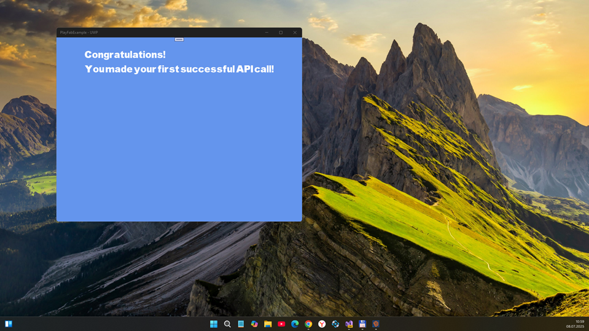

# PlayFabExample 1.0 ("Potential for Anything" codename)

My micro-RnD of MonoGame cross-platform Monogame-based sample integrated with PlayFab. UWP support planned

## Preface

This solution is my PoC of  MonoGame "multi-platform mobile game sample/template" integrated with PlayFab.

Techniclly, this is an example showing how to use the https://github.com/dmanning23/PlayFabBuddy.Core package

## Screenshots (Desktop app & UWP)

## My 2 cents
- Monogame framework/engine switched from 3.7 to 3.8 
- UWP "target" added (Min. Win. SDK version is 10240)
- PlayFabBuddy.Core very quickly "cloned" (in)to UWP :)

## How to use it
- Sign-up to PlayFub 
- Create some test project, and grab app-id
- Find 

var playFabClient = new PlayFabClient("144") 

code line (in Game.cs) and substitute "144" with app-id

## TODO
- Realize some game login
- Add some sprites and simplest multi-player game control... :)

## .
As is. No support. DIY. Learn purposes only.

## Reference(s)
- https://github.com/dmanning23/PlayFabExample Original PlayFab example
- https://github.com/dmanning23/PlayFabBuddy.Core Original PlayFabBuddy.Core library
- https://learn.microsoft.com/en-us/windows/uwp/gaming/e2e Windows game development guide
- https://playfab.com/ Azure PlayFab (complete backend solution for live games; free plan exists)
- https://souleyedigitalmusic.bandcamp.com/track/potential-for-anything Potential for Anything
(VVVVVV soundtrack by Magnus Pålsson)

## ..
[m][e] July, 8 2025

